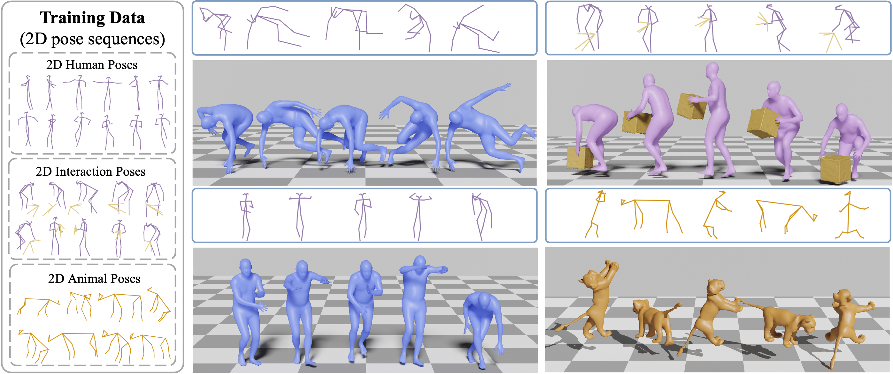

# Lifting Motion to the 3D World via 2D Diffusion (CVPR 2025 Highlight)
This is the official implementation for the CVPR 2025 [paper](https://arxiv.org/abs/2411.18808). For more information, please check the [project webpage](https://lijiaman.github.io/projects/mvlift/).



## Environment Setup
> Note: This code was developed on Ubuntu 20.04 with Python 3.8, CUDA 11.3 and PyTorch 1.11.0.

Clone the repo.
```
git clone https://github.com/lijiaman/mvlift_release.git
cd mvlift_release/
```
Create a virtual environment using Conda and activate the environment. 
```
conda create -n mvlift_env python=3.8
conda activate mvlift_env 
```
Install PyTorch. 
```
conda install pytorch==1.11.0 torchvision==0.12.0 torchaudio==0.11.0 cudatoolkit=11.3 -c pytorch
```
Install PyTorch3D. 
```
conda install -c fvcore -c iopath -c conda-forge fvcore iopath
conda install -c bottler nvidiacub
pip install --no-index --no-cache-dir pytorch3d -f https://dl.fbaipublicfiles.com/pytorch3d/packaging/wheels/py38_cu113_pyt1110/download.html
```
Install human_body_prior. 
```
git clone https://github.com/nghorbani/human_body_prior.git
pip install tqdm dotmap PyYAML omegaconf loguru
cd human_body_prior/
python setup.py develop
```


## Prerequisites 
Please download [SMPL-X](https://smpl-x.is.tue.mpg.de/index.html) and put the model to ```data/smpl_all_models/```.

If you would like to generate visualizations, please download [Blender](https://www.blender.org/download/) first. And modify ```BLENDER_PATH, BLENDER_UTILS_ROOT_FOLDER, BLENDER_SCENE_FOLDER``` in line 8-10 of ```mvlift_release/diffusion_motion_2d/m2d/vis/blender_vis_mesh_motion.py```. 

Please download all the [data](https://drive.google.com/drive/folders/1ZMtYQEWw2wHJcWmJeNTlaoGHLbtZdjLO?usp=sharing) and put ```processed_data``` to your desired location ```your_path/processed_data```.  

Please put the code [smal_model](https://github.com/silviazuffi/smalst/tree/master/smal_model) in the folder diffusion_motion_2d/m2d/model/. 

## Datasets 
We currently provided processed data for AIST in the above link. For original AIST videos, please check the original dataset [AIST](https://aistdancedb.ongaaccel.jp/list_of_related_publications/). For 3D ground truth motion, please download from [AIST++](https://google.github.io/aistplusplus_dataset/download.html) (3D ground truth is needed if you want to do quantitative evaluation). 

Other datasets will be uploaded soon. 

## Training and Evaluation Instructions
### Step 1: Train a line-conditioned 2D motion diffusion model  
```
cd aist_scripts/
sh step1_train_line_cond_2d_diffusion.sh 
```

### Step 2: Generate a synthetic 3D motion dataset by optimization using the learned line-codnitioned 2D diffusion model   
```
cd aist_scripts/
sh step2_gen_syn3d_data.sh 
```

### Step 3: Train a multi-view 2D motion diffusion model 
```
cd aist_scripts/
sh step3_train_multiview_2d_diffusion.sh 
```

### Step 4: Test the final learned multi-view 2D motion diffusion model 
Note that to run quantitative evaluation using AIST ground truth motion, you need to prepare the AIST++ dataset and modify the data path in diffusion_motion_2d/m2d/data/aist_motion3d_dataset.py.  
```
cd aist_scripts/
sh step4_eval_multiview_2d_diffusion.sh 
```
To generate skeleton visualization and prepare human meshes for Blender visualization, disable --eval_w_best_mpjpe. For using Blender to generate visualization, please modify the path in diffusion_motion_2d/m2d/vis/gen_blender_vis_res.py.And you will be able to produce Blender visualization. 
```
python gen_blender_vis_res.py
```

### Citation
```
@inproceedings{li2025lifting,
  title={Lifting motion to the 3d world via 2d diffusion},
  author={Li, Jiaman and Liu, C Karen and Wu, Jiajun},
  booktitle={Proceedings of the Computer Vision and Pattern Recognition Conference},
  pages={17518--17528},
  year={2025}
}
```

### Related Repos
We adapted some code from other repos in data processing, learning, evaluation, etc. Please check these useful repos. 
```
https://github.com/lijiaman/omomo_release
https://github.com/lijiaman/egoego_release
https://github.com/EricGuo5513/text-to-motion 
https://github.com/lucidrains/denoising-diffusion-pytorch
https://github.com/jihoonerd/Conditional-Motion-In-Betweening 
https://github.com/lijiaman/motion_transformer 
``` 